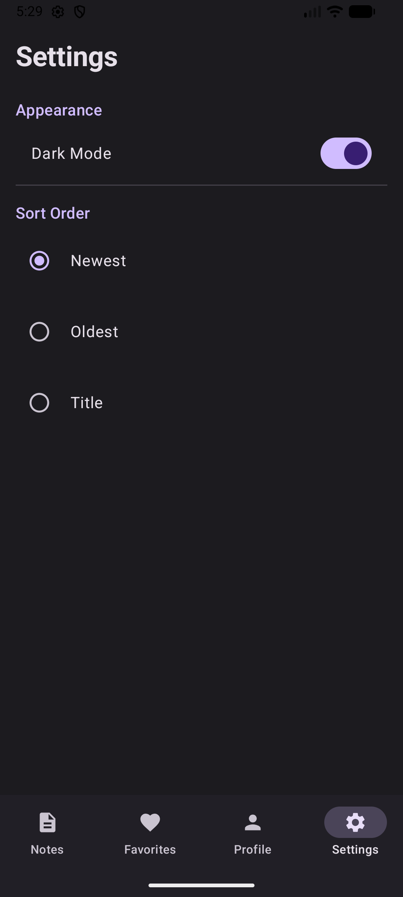
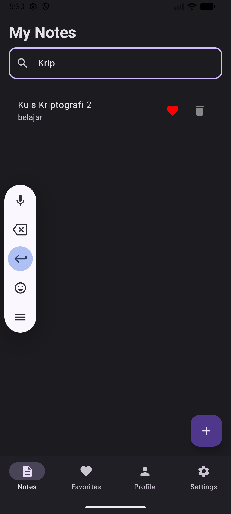
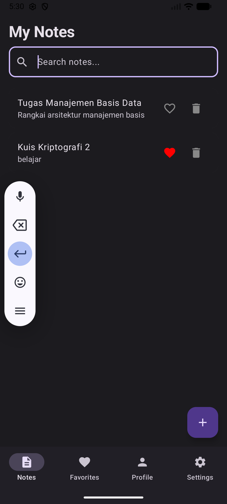
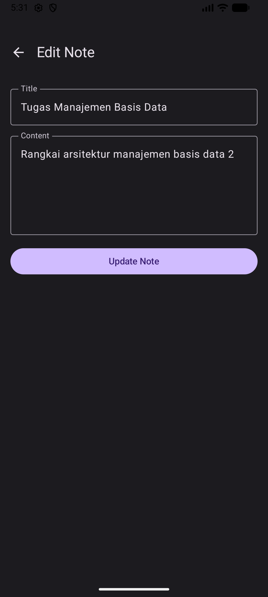

# Note App - Kotlin Multiplatform (Tugas SQLDelight)

Aplikasi manajemen catatan (Notes) modern yang dibangun menggunakan **Compose Multiplatform**. Proyek ini mengimplementasikan sistem penyimpanan data lokal yang efisien menggunakan **SQLDelight**, manajemen preferensi pengguna dengan **Jetpack DataStore**, serta penanganan status UI yang komprehensif dan mendukung prinsip *offline-first*.

Link Video Demo [Demo Penggunaan](https://youtu.be/akvW3dRhSLg)

## Fitur Utama

### 1. Operasi CRUD (SQLDelight)
Implementasi penuh penyimpanan data lokal menggunakan SQLDelight yang bersifat *type-safe*:
- **Create**: Menambahkan catatan baru dengan judul dan isi konten.
- **Read**: Menampilkan daftar catatan secara real-time dari database SQLite.
- **Update**: Mengedit judul, isi catatan, atau menandai catatan sebagai favorit.
- **Delete**: Menghapus catatan secara permanen dari penyimpanan lokal.

### 2. Fitur Pencarian (Search Functionality)
Dilengkapi dengan fitur pencarian yang responsif. Pengguna dapat mencari catatan tertentu berdasarkan kata kunci pada judul atau isi konten secara instan (real-time) melalui query SQL yang dioptimalkan.

### 3. Pengaturan (Settings) dengan DataStore
Mengelola preferensi pengguna secara persisten menggunakan Jetpack DataStore:
- **Theme Selection**: Beralih antara Tema Terang (Light) dan Tema Gelap (Dark).
- **Sort Order**: Mengatur urutan tampilan catatan (berdasarkan waktu terbaru atau terlama) yang tersimpan secara permanen di DataStore.

### 4. Offline First & UI States
- **Offline First**: Aplikasi memprioritaskan data lokal. Semua data disimpan di SQLite, sehingga aplikasi tetap berfungsi penuh tanpa koneksi internet.
- **Proper UI States**: Implementasi status antarmuka untuk pengalaman pengguna yang lebih baik:
    - **Loading State**: Menampilkan indikator saat aplikasi sedang memproses atau memuat data.
    - **Empty State**: Tampilan informatif jika belum ada catatan yang dibuat.
    - **Content State**: Menampilkan daftar catatan dengan transisi yang halus saat data tersedia.

---

## Dokumentasi Visual

| Profile Screen | Sort Order | Searching |
| :---: | :---: | :---: |
|  |  |  |

| Delete Notes | Edit Notes |
| :---: | :---: |
|  |  |

---

## Arsitektur & Teknologi

- **Compose Multiplatform**: Framework UI untuk Android dan Desktop.
- **SQLDelight**: Database lokal untuk Kotlin Multiplatform dengan validasi skema saat compile-time.
- **Jetpack DataStore**: Solusi penyimpanan preferensi (Key-Value) yang modern dan asinkron.
- **MVVM Architecture**: Pemisahan logika bisnis (ViewModel) dan tampilan (UI) untuk kode yang lebih modular.
- **Kotlin Coroutines & Flow**: Pengelolaan data asinkron dan aliran data reaktif dari database ke UI.

---

## Cara Menjalankan

1. Buka proyek menggunakan **Android Studio** (versi Ladybug atau terbaru).
2. Lakukan **Gradle Sync** untuk memastikan semua dependensi terunduh dengan benar.
3. Jalankan aplikasi:
   - **Android**: Pilih target emulator/device dan jalankan modul `:composeApp`.
   - **Desktop**: Jalankan perintah `./gradlew :composeApp:run` melalui terminal Android Studio.

**Disusun Oleh:** Miftahul Khoiriyah  
**Jurusan:** Teknik Informatika - ITERA
